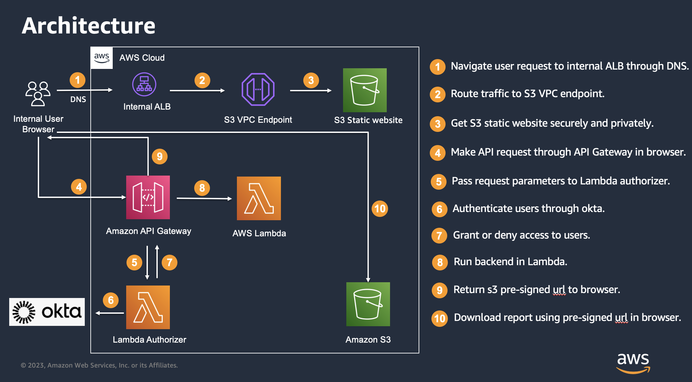
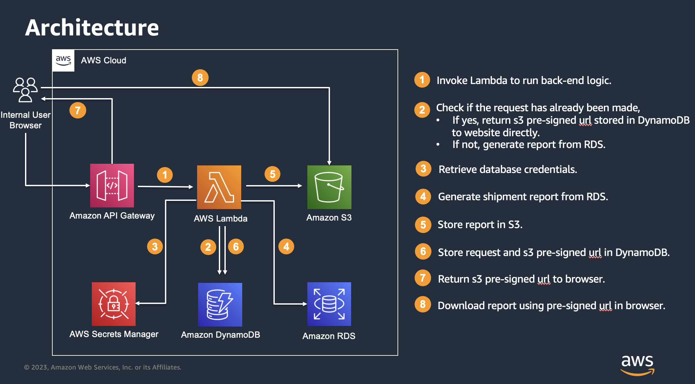

# ShipmentForecastDownload
The business team manually downloads the shipment report from database on a daily basis, with less than 100 downloads per day.

## Requirement
* The website should be static.
* Website should be only accessible internally, and all resources need to be private.
* If the user makes the same request again, the report should be retrieved directly from S3,  instead of generating it again from the database.

## Architecture
`This POC only implements the architecture1`

